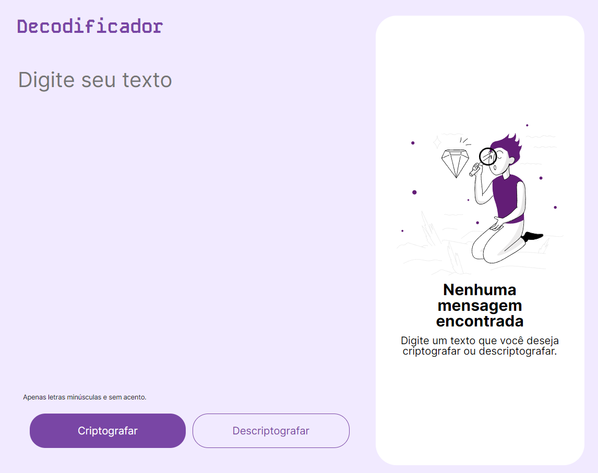

# 💻 Projeto Decodificador

> Projeto desenvolvido como desafio para Alura

> O objetivo do projeto é criar um site que encripte e desencripte textos baseados em uma lista de vogais x palavras.

## Acesso

O site pode ser acesso através do link:

[de-codificador-indol.vercel.app](https://de-codificador-indol.vercel.app/)

## Tecnologias e Ferramentas

  - HTML
  - CSS
  - Javascript
  - [Figma](https://www.figma.com)
  - [VS Code](https://code.visualstudio.com/)

## ☕ Características

1. O site só permite que você digite letras minúsculas para encriptar. Caso tente inserir letras maiúsculas ou símbolos, eles serão imediatamente apagados.
2. Os valores encriptados e desencriptados podem ser copiados diretamente para a área de transferência através do botão "copiar".
3. Foi utilizado CSS para mostrar ou ocultar itens de acordo com o tamanho da página.
4. O site foi adaptado para ser responsivo em resoluções de largura: 1440px, 768px e 375px.
5. AA implementação lógica em JavaScript utilizou funcionalidades nativas da linguagem para tornar o código conciso e menos verboso. O código pode ser encontrado [AQUI](js/script.js) ou em: 'js/script.js'.

## 📝 Licença

Esse projeto está sob licença. Veja o arquivo [LICENÇA](LICENSE.md) para mais detalhes.
