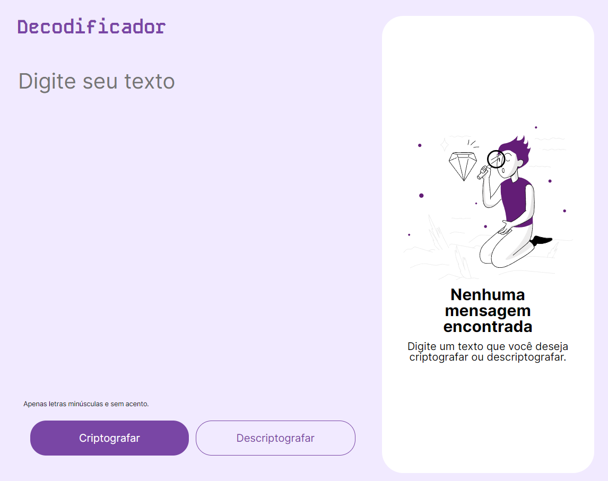
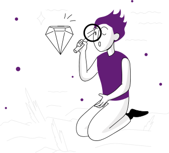
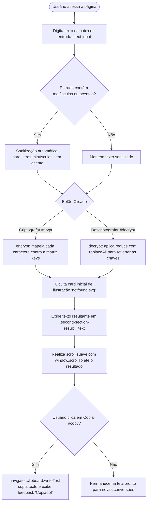

# 💻 Projeto Decodificador

<br />

<div align="center">

[](https://de-codificador-indol.vercel.app/)
[](https://developer.mozilla.org/pt-BR/docs/Web/HTML)
[](https://developer.mozilla.org/pt-BR/docs/Web/CSS)
[](https://developer.mozilla.org/pt-BR/docs/Web/JavaScript)
[](https://www.figma.com/)
[](https://www.alura.com.br/)
[](LICENSE)
[](#)

</div>

---

<details open>
  <summary><strong>🖥️ Visualização da Interface da Aplicação</strong></summary>

  <br />

  <div align="center">
    
  </div>

</details>

<br />

<details>
  <summary><strong>🔍 Ilustração de Estado Vazio (Sem Mensagem)</strong></summary>

  <br />

  <div align="center">
    
  </div>

</details>

---

> Projeto desenvolvido como desafio para Alura

> O objetivo do projeto é criar um site que encripte e desencripte textos baseados em uma lista de vogais x palavras.

---

## Acesso

O site pode ser acesso através do link:

[de-codificador-indol.vercel.app](https://de-codificador-indol.vercel.app/)

---

## Tecnologias e Ferramentas

  - HTML
  - CSS
  - Javascript
  - [Figma](https://www.figma.com)
  - [VS Code](https://code.visualstudio.com/)

### Detalhamento da Stack

| Ferramenta | Papel no Projeto |
| :--- | :--- |
| **HTML5** | Estruturação semântica com `<main>`, `<section>`, `<textarea>` e botões acessíveis. |
| **CSS3** | Layout responsivo, normalização com `reset.css`, tipografia Inter/Montserrat e efeito `typewriter.css`. |
| **JavaScript Vanilla** | Algoritmos de encriptação com matrizes, substituição com `reduce`/`replaceAll` e Clipboard API. |
| **Figma** | Guia visual de fidelidade de design fornecido pela Alura para o desafio do programa ONE. |
| **Vercel** | Plataforma de nuvem para deploy contínuo e entrega rápida da aplicação web. |

---

## ☕ Características

1. O site só permite que você digite letras minúsculas para encriptar. Caso tente inserir letras maiúsculas ou símbolos, eles serão imediatamente apagados.
2. Os valores encriptados e desencriptados podem ser copiados diretamente para a área de transferência através do botão "copiar".
3. Foi utilizado CSS para mostrar ou ocultar itens de acordo com o tamanho da página.
4. O site foi adaptado para ser responsivo em resoluções de largura: 1440px, 768px e 375px.
5. A implementação lógica em JavaScript utilizou funcionalidades nativas da linguagem para tornar o código conciso e menos verboso. O código pode ser encontrado [AQUI](js/script.js) ou em: 'js/script.js'.

---

## 🔐 Regras de Criptografia e Chaves de Substituição

O desafio estabelece uma tabela de substituição biunívoca baseada nas vogais:

| Letra Original | Chave Criptográfica | Exemplo de Aplicação |
| :---: | :---: | :--- |
| **`a`** | `ai` | `casa` ➔ `caisai` |
| **`e`** | `enter` | `ele` ➔ `enternter` |
| **`i`** | `imes` | `rio` ➔ `rimesober` |
| **`o`** | `ober` | `sol` ➔ `soberl` |
| **`u`** | `ufat` | `lua` ➔ `lufatai` |

> **Exemplo completo:** A palavra **`gato`** é convertida para **`gaitober`**, e o processo inverso (**descriptografia**) reverte com precisão `gaitober` para `gato`.

---

## 🔄 Fluxo de Processamento e Algoritmo


```mermaid
flowchart TD
    A([Usuário acessa a página]) --> B[Digita texto na caixa de entrada #text-input]
    B --> C{Entrada contém maiúsculas ou acentos?}
    C -- Sim --> D[Sanitização automática para letras minúsculas sem acento]
    C -- Não --> E[Mantém texto sanitizado]

    D --> F{Botão Clicado}
    E --> F

    F -- Criptografar #crypt --> G[encrypt: mapeia cada caractere contra a matriz keys]
    F -- Descriptografar #decrypt --> H[decrypt: aplica reduce com replaceAll para reverter as chaves]

    G --> I[Oculta card inicial de ilustração 'notfound.svg']
    H --> I

    I --> J[Exibe texto resultante em .second-section-result__text]
    J --> K[Realiza scroll suave com window.scrollTo até o resultado]
    K --> L{Usuário clica em Copiar #copy?}
    L -- Sim --> M[navigator.clipboard.writeText copia texto e exibe feedback 'Copiado!']
    L -- Não --> N[Permanece na tela pronto para novas conversões]
```

---

## 🏗️ Estrutura de Pastas e Arquitetura

```bash
De_Codificador/
├── assets/                                    # Recursos visuais e gráficos
│   ├── notfound.svg                           # Ilustração SVG exibida quando nenhum texto foi processado
│   └── sitre-screenshot.PNG                   # Captura de tela da aplicação em funcionamento
├── css/                                       # Folhas de estilo modularizadas
│   ├── reset.css                              # Reset básico para compatibilidade cross-browser
│   ├── style.css                              # Estilos principais, responsividade e posicionamento
│   └── typewriter.css                         # Efeito de máquina de escrever animado via @keyframes
├── js/                                        # Lógica cliente da aplicação
│   └── script.js                              # Funções encrypt, decrypt, cópia para clipboard e eventos
├── index.html                                 # Estrutura semântica principal da aplicação
└── README.md                                  # Documentação técnica do projeto
```

---

## 💻 Como Executar o Projeto Localmente

### Pré-requisitos
* Qualquer navegador web moderno (Google Chrome, Mozilla Firefox, Microsoft Edge, Safari).
* [Git](https://git-scm.com/) para clonar o repositório.

### Inicialização Rápida

1. Clone o repositório em sua máquina:
```bash
git clone https://github.com/erickystn/De_Codificador.git
```

2. Acesse a pasta do projeto:
```bash
cd De_Codificador
```

3. Abra o arquivo `index.html` diretamente no navegador:
```bash
# No Linux / macOS
open index.html

# No Windows
start index.html
```
*Alternativamente, utilize a extensão **Live Server** no Visual Studio Code.*

---

## 💻 Exemplos de Código

### Implementação das Funções Criptográficas (`js/script.js`)
```javascript
const keys = [
  ["a", "ai"],
  ["e", "enter"],
  ["i", "imes"],
  ["o", "ober"],
  ["u", "ufat"],
];

function encrypt(text, keys) {
  return text
    .split("")
    .map((item) =>
      keys.find((key) => key[0] === item)
        ? keys.find((key) => key[0] === item)[1]
        : item
    )
    .join("");
}

function decrypt(textEncrypt, keys) {
  return keys.reduce(
    (prev, act) => prev.replaceAll(act[1], act[0]),
    textEncrypt
  );
}
```

---

## 📈 Próximos Passos e Melhorias (Roadmap)

- [ ] **Modo Escuro (Dark Mode):** Adicionar alternância para tema escuro preservando alto contraste.
- [ ] **Suporte a Áudio (Web Speech API):** Incluir botão para leitura em voz alta do texto decodificado.
- [ ] **Histórico de Conversões:** Salvar as últimas mensagens criptografadas na sessão com `sessionStorage`.
- [ ] **Contador de Caracteres:** Exibir contador dinâmico de palavras e caracteres digitados.

---

## 🤝 Como Contribuir

1. Faça um **Fork** deste repositório.
2. Crie uma branch para sua modificação:
   ```bash
   git checkout -b feature/sua-melhoria
   ```
3. Commit suas alterações:
   ```bash
   git commit -m "feat: adiciona alternador de tema escuro"
   ```
4. Envie sua branch para o repositório remoto:
   ```bash
   git push origin feature/sua-melhoria
   ```
5. Abra um **Pull Request** para revisão.

---

## 👤 Autor & Créditos

* **Desenvolvedor:** [Ericky Sant'ana](https://github.com/erickystn)
* **Programa e Desafio:** Desafio do programa **Oracle Next Education (ONE)** em parceria com a [Alura](https://www.alura.com.br/).

---

## 📝 Licença

Esse projeto está sob licença **MIT**. Veja o arquivo [LICENÇA](LICENSE) para mais detalhes.
